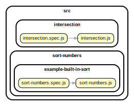

<!-- BEGIN TITLE -->

# DOCS

<!-- END TITLE -->

<!-- BEGIN TREE -->

> [interactive graph](./dependency-graph.html)



<!-- END TREE -->

<!-- BEGIN TOC -->

- deep-flat
- difference
- intersection
  - [intersection.js](#\src\intersection\intersectionjs)
- sort-numbers
  - example-built-in-sort
    - [sort-numbers.js](#\src\sort-numbers\example-built-in-sort\sort-numbersjs)
- split-object

---

<!-- END TOC -->

---

<!-- BEGIN DOCS -->

# /deep-flat

---

# /difference

---

# /intersection

<details><summary><a href="../..\src\intersection\intersection.js" id="\src\intersection\intersectionjs">..\src\intersection\intersection.js</a></summary>

<a name="intersection"></a>

## intersection ⇒ <code>Array</code>

Check the values of the second array and see if they are included in the first one.

If they are, send them to a third array.

Follow the order of the first array.

Check if there are repeated elements in the array. If that's the case, eliminate the repeated elements.

**Returns**: <code>Array</code> - [arr3 = []] - Returns a new array and without affecting the other two.

Intersection([2, 1], [2, 3]);
// -> [2]

| Param  | Type               | Default         | Description                                                      |
| ------ | ------------------ | --------------- | ---------------------------------------------------------------- |
| [arr1] | <code>Array</code> | <code>[]</code> | The first array to check.                                        |
| [arr2] | <code>Array</code> | <code>[]</code> | The values to compare and include if present in the first array. |

**Example**

```js
intersection([2, 1, 2], [2, 3]);
// -> [2]
```

</details>

---

# /sort-numbers

## /example-built-in-sort

<details><summary><a href="../..\src\sort-numbers\example-built-in-sort\sort-numbers.js" id="\src\sort-numbers\example-built-in-sort\sort-numbersjs">..\src\sort-numbers\example-built-in-sort\sort-numbers.js</a></summary>

<a name="sortNumbers"></a>

## sortNumbers ⇒ <code>Array.&lt;number&gt;</code>

Sorts an array of numbers from smallest to largest.

Returns a new array without modifying the original array.

Does not need to support: NaN, Infinity, -Infinity.

**Returns**: <code>Array.&lt;number&gt;</code> - A new array with the same numbers, but sorted.

| Param          | Type                              | Default         | Description                   |
| -------------- | --------------------------------- | --------------- | ----------------------------- |
| [arrOfNumbers] | <code>Array.&lt;number&gt;</code> | <code>[]</code> | The array of numbers to sort. |

**Example**

```js
sortNumbers([1.5, 1, -1.5, 0, -1]);
// -> [-1.5, -1, 0, 1, 1.5]
```

**Example**

```js
sortNumbers([-1, 0, 1]);
// -> [-1, 0, 1]
```

</details>

---

---

# /split-object

---

<!-- END DOCS -->
